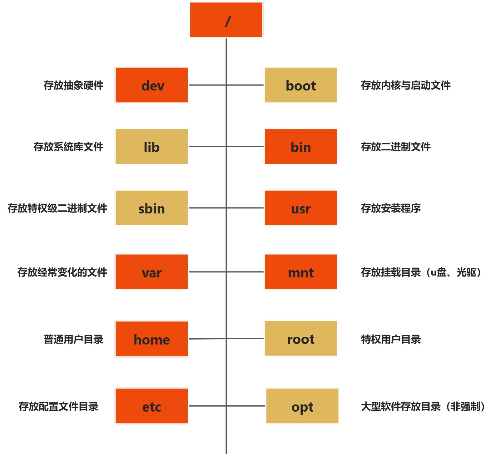

# Linux 系统文件

## /etc 初始化系统重要文件

| 路径                                                         | 描述                                   |
| ------------------------------------------------------------ | -------------------------------------- |
| /etc/sysconfig/network-scripts/ifcfg-eth0                    | 网卡配置文件                           |
| /etc/resolv.conf                                             | Linux 系统 DNS 客户端配置文件          |
| /etc/hostname (CentOS 7)   /etc/sysconfig/network (CentOS 6) | 主机名配置文件                         |
| /etc/hosts                                                   | 系统本地的 DNS 解析文件                |
| /etc/fstab                                                   | 配置开机设备自动挂载的文件             |
| /etc/rc.local                                                | 存放开机自启动程序命令的文件           |
| /etc/inittab                                                 | 系统启动设定运行等级等配置的文件       |
| /etc/profile   /etc/bashrc                                   | 配置系统的环境变量/别名等的文件        |
| /etc/profile.d                                               | 用户登录后执行的脚本所在的目录         |
| /etc/issue   /etc/issue.net                                  | 配置在用户登录终端前显示信息的文件     |
| /etc/init.d                                                  | 软件启动程序所在的目录 (CentOS 6)      |
| /usr/lib/systemd/system/                                     | 软件启动程序所在的目录(CentOS 7)       |
| /etc/motd                                                    | 配置用户登录系统之后显示提示内容的文件 |
| /etc/redhat-release                                          | 声明 RedHat 版本号和名称信息的文件     |
| /etc/sysctl.conf                                             | Linux 内核参数设置文件                 |

## /proc 重要路径 

| 路径          | 描述                                   |
| ------------- | -------------------------------------- |
| /proc/meminfo | 系统内存信息                           |
| /proc/cpuinfo | 关于处理器的信息，如类型、厂家、型号等 |

## Linux 目录结构

