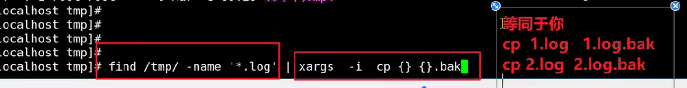
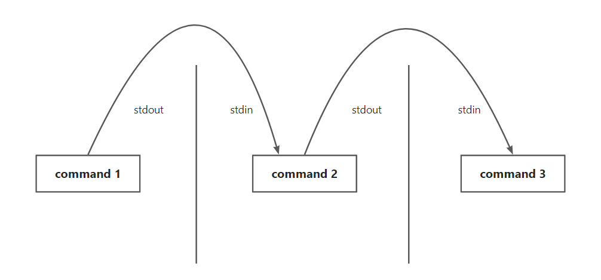

# Linux 命令集合

## mkdir 命令

1. 命令说明：mkdir 创建目录命令
2. 用法1：mkdir不加参数，路径（需要包含目录名称）
   1. 绝对路径创建：`mkdir /opt/project`
   2. 相对路径创建：`mkdir ../project/test`
3. 用法2：``【-p】``递归创建
   1. `mkdir /opt/project/linux/lsj`
4. 用法3：同时创建多个文件夹
   1. `mkdir ./dnf /opt/cs ../lol`
5. 在同一目录下创建多个目录
   1. `mkdir -p /opt/game/{dnf,lol,cs}`

## rmdir 命令

1. 命令说明：删除空目录命令
2. 语法：rmdir 目录的路径
3. 要求：要删除的文件夹，里面没有数据，方可删除，否则提示该文件夹不为空
4. `rmdir /opt/project/linux/test`，如果test目录不为空，则会删除失败。

## touch 命令

1. 命令说明：创建文件命令，多次创建不报错
2. 创建多个文件，不写路径，等同于 ./：``touch lsj.txt linux.txt`` 
3. 创建多个文件，带上路径：`touch /opt/test/lsj.txt /opt/test/linux.txt`
4. 复杂写法，在多个目录下创建：`touch /opt/lsj/lsj.txt /opt/linux/linux.txt` 
5. 在同一目录下创建多个文件：`touch /opt/game/{dnf,lol,cs}` 

## rm 命令

1. 命令说明：删除命令
2. 参数
   1. `【-r】` `递归删除，主要用于删除目录，可删除指定目录及包含的所有内容，包括所有子目录和文件
   2. `【-f】`强制删除，不提示任何信息，操作前一定要慎重！！
   3. `【-i】`删除前需要确认
3. 用法
   1. 删除一个文件：`rm /opt/test/test1.html`
   2. 删除多个文件：`rm ./test.html /opt/test/test1.html`
   3. 强制删除：`rm -f /opt/test/test1.html`
   4. 删除目录：`rm -r /opt/test`
   5. 删除前确认：`rm -i /opt/test/test1.html`
   6. 强制递归删除所有目录及文件：`rm -rf /opt/test`

## cp 命令

1. 命令说明：拷命令贝
2. 参数
   1. `【-r】`递归拷贝
3. 用法
   1. 拷贝文件，且改名：`cp /opt/lol/mid/yasuo.txt /home/tuoersuo.txt`
   2. 仅仅拷贝单个文件，保持源文件名：`cp /opt/lol/mid/yasuo.txt /`
   3. 拷贝文件夹，递归拷贝：`cp -r 源文件夹路径 目标文件夹路径`
   4. 注意：目标目录是否存在同名文件夹，存在则移动到它的目录中去

## mv 命令

1. 命令说明：移动、剪切、重命名命令
2. 用法
   1. 移动单个文件：`mv /opt/lol/yasuo.txt /home/lsj`
   2. 不移动文件的重命名：`mv /opt/lol/yasuo.txt /opt/lol/tuoersuo.txt`
   3. 移动文件的重命名：`mv /opt/lol/yasuo.txt /home/lsj/tuoersuo.txt`
   4. 注意：目标目录是否存在同名文件夹，存在则移动到它的目录中去

## tar 命令

1. 命令说明：打包、压缩、解压缩命令，tar 实现的是打包、压缩还是解压缩，具体要看使用的哪个参数。
2. 后缀说明：
   1. *.tar 仅仅是打包了
   2. *.tar.gz 打包+压缩
   3. *.tgz 打包+压缩
3. 参数
   1. `【-c】`create 创建的意思，打包使用
   2. `【-v】`显示打包文件过程
   3. `【-f】`指定打包的文件名，此参数是必须加的，且必须在最后以为
   4. `【-u】`update 更新原打包文件中的文件
   5. `【-t】`查看打包的文件内容（不解压查看压缩包内的内容）
   6. `【-x】`解包，解压缩（将一个单个的压缩文件，解压其中内容）
   7. 【``-z】``压缩操作参数，是 tar 命令调用 gzip 命令的过程
   8. `【-j】`压缩为 .bz2 格式
   9. `【-J】`压缩为 .xz 格式
4. 打包、解包用法
   1. 文件打成 tar 包，指定文件进行打包：`tar -cvf all-txt-opt.tar 1.txt 3.txt 4.txt` 
   2. 查看压缩文件内容：`tar -tf all-txt-opt.tar`
   3.  追加文件到已存在的压缩包内：`tar -uf all-txt-opt.tar /opt/test/index.html`           
   4. 解包、拆包、拆包打开文件：`tar -xvf all-txt-opt.tar` 
5.  压缩用法
   1. 打包并压缩：`tar -czvf all_files.tar.gz 1.txt 3.txt 4.txt`                                                                                                                                                                                                                                                                                                                                                               

## zip 命令

1. 命令说明：打包、压缩命令，兼容 unix 与 windows，可以压缩多个文件或目录
2. 参数
   1. `【-r】`递归压缩（压缩文件夹）
3. 用法
   1. 打包多个文件：`zip all_files.zip 1.txt 3.txt 4.txt` 
   2. 打包文件夹：`zip -r all_files_folder.zip 1.txt test/`

## unzip 命令

1. 命令说明：解压缩命令，兼容 unix 与 windows
2. 参数
   1. `【-d】`表示指定文件解压缩之后要存储的目录
3. 用法
   1. 解压压缩包到指定目录：`unzip -d all_files_folder.zip /opt/test/`

## Cat 命令

1. 命令说明：查看文件内容

2. 语法：`cat index.txt`

3. 注意：cat 命令是一次性把文件内容全部读取出来，如果文件内容过大，有可能会导致机器卡死，并且你也看不到想要看的内容，因此 cat 命令不适合读取大文件，适合阅读内容较少的文件。（可以结合 Linux 其他命令来二次加工大文件）

4. 用法：

   1. 查看用户信息有哪些：`cat /etc/passwd`

   2. 添加参数``【-n】``显示行号：`cat -n /etc/passwd`

   3. 不适合读取大文件，显示也不友好：`cat /var/log/messages`

   4. 还可以连续读取多个我呢见，并且显示多个文件一共多少行：`cat -n text.txt hello.txt python.txt`

   5. 结合重定向符号使用：

      1. `<`：重定向覆盖输出符，数据从左边，覆盖写入到右边，例如：`cat hehe.txt test.txt > ./two_files.txt`
      2. `>`：重定向覆盖输入符，数据从右边，覆盖写入到左边
      3. `>>`：重定向追加输出符，数据从左边，追加写入到右边
      4. `<<`：重定向追加输入符，数据从右边，追加写入到左边

   6. 实现文本内容写入，cat 命令和重定向符号结合使用，写法如下，一般用于写入多行数据，其中 EOF 关键字是 end of file 缩写：

      1. ```bash
         cat >> 古诗2.txt << EOF
         你的数据写在这里···
         EOF
         ```

   7. 证明文件存在空行的办法：

      1. 参数``【-b】`` 只会对有内容的行显示行号，空行不显示
      2. 参数``【-E】`` 在 Linxu 文件中，每一行的结束，默认会添加一个你看不到的特殊符号`$` ，表示是该行的结尾，可以用于查看文件内的字节数，一个英文字母一个字节。

## tac 命令

1. 命令说明：将文件从后向前倒着查看
2. 语法：`tac index.txt`

## more 命令

1. 命令说明：分屏查看文件内容，一般用于读取较多内容文件，如小说文件。
2. 特点：more 和 cat 一样，会一次性读取文件所有内容到内存中，比较消耗资源，不适合太大文件。
3. 语法：`more xiaoshuo.txt`
4. 用法：
   1. `空格`--翻页
   2. `回车`--下一行

## less 命令

1. 命令说明：显示多少文本，消耗多少内存，比较省资源
2. 语法：`less xiaoshuo.txt`
3. 用法：
   1. `空格`--翻页
   2. `回车`--下一行

## head 命令

1. 命令说明：查看文件的默认前10行
2. 语法：`head xiaoshuo.txt`
3. 查看文件的前100行：`head -100 xiaoshuo.txt`

## tail 命令

1. 命令说明：查看文件的默认后10行
2. 语法：`tail xiaoshuo.txt`
3. 查看文件的后100行：`tail -100 xiaoshuo.txt`
4. 【重点】实时刷新文件内容：
   1. ``【-f】``：跟踪文件内容变化，但是需要文件正常退出后才可见，该参数最为常用，常用于检测程序的日志变化（程序代码，追加新内容到文件中）：`tail -f xiaoshuo.txt`
   2. `【-F】`：能够对文件进行刷新读取，即使该文件不存在，也可以检测

## wc 命令

1. 命令说明：单词统计（word count）
2. 作用：用来统计文件内的信息，一般统计如行数、单词数、字节数
3. 参数：
   1. `【-l】`：表示 lines，行数（回车/换行符为标准）
   2. `【-w】`：表示 words，单词数，按照空格来判断单词数量
   3. `【-c】`：表示 bytes，字节数（空格、回车、换行） 
4. 用法：
   1. 获取某个文件的行数：`wc -l xiaoshuo.txt`
   2. 统计某个文件夹下所有文件行数：`wc -l ./`
   3. 统计文件内的单词数量：`wc -w xiaoshui.txt`

## du 命令

1. 命令说明：查看文件或目录（会递归显示目录）占用磁盘空间大小
2. 语法：du [参数选项] 文件名或目录名
3. 参数：
   1. `【-s】`：summaries，只显示汇总的大小，统计文件夹的大小
   2. `【-h】`：表示以高可读性的形式进行展示，如果不写 -h，默认以 KB 的形式显示文件大小
4. 用法：
   1. 显示文件夹的大小：`du -h /opt`
   2. 查询当前文件夹下文件大小：`du -h *`
   3. 查看日志文件夹大小：`du -sh /var/log`

## find 命令

1. 命令说明：用于搜索整个 Linux 系统中的文件、文件夹，便于你找出机器上的文件。
2. 语法：`find 搜索路径 选项1 选项1的值 选项2 选项2的值`
3. 参数：
   1. `【-name】`：指定文件夹名字，指定你要搜索的文件名字叫什么，以及可以填入 * 表示通配符，模糊搜索
   2. `【-type】`：指定文件类型，文件还是文件夹，还是其他。
      1. `-type f`：找到文本类型的数据
      2. `-type d`：找到文件夹类型的数据
4. 用法：
   1. 根据名称模糊查询：``find / -name '*.txt'``
   2. 根据名称精确查询：``find / -name 'xiaoshuo.txt'``
   3. 查询指定文件类型：``find / -type f -name 'xiaoshuo.txt'``
   4. 查询指定文件夹类型：``find / -type d -name 'xiaoshuo.txt'``

## grep 命令

1. 命令说明：直接在文件中搜索出你想要的数据，且高亮显示。不仅能从文件里搜索关键字，只要是文本数据，就可以进行搜索过滤。
2. 语法：``grep '关键字' 文件名``
3. 参数：
   1. `【-n】`：显示行号
   2. `【-i】`：忽略大小写
   3. `【-l】`：数据从哪个文件找出来的
4. 用法：
   1. 找出‘My’：`grep 'My' xiaoshuo.txt`
   2. 找出‘my’，并显示行号：`grep -n 'my' xiaoshuo.txt`
   3. 从当前目录下所有文件中搜索：`grep 'apploe' ./*`
   4. 利用 grep 找出 nginx 配置文件中定义的网站监听端口号：`grep -n -i 'listen' /etc/nginx/nginx.conf`

## xargs 参数构造

1. 命令说明：又称管道命令，构造参数等，简单说就是把其他命令给它的数据传递给他后面的命令作为参数

2. 语法：`命令1 | xargs 选项`，其中的**选项**用{}代替传递数据

3. 实现批量备份：`find /tmp/ -name '*.log' | xargs -i cp {} {}.bak`

   

4. 实现批量重命名，将文件的 txt 后缀修改为 log：`find /tmp/ -name '*.txt' | xargs -i rename txt log {}`

## find 命令的 exec 扩展选项

1. 说明：用于 find 命令找出来匹配的文件后，再交给其他的 linux 命令加工。比如：你有一个需求，找出所有的 txt 文件，并且要删除他们。

2. 实战

   ```bash
   # 1. 使用 xargs 进行参数构造以及配合管道符二次加工
   find /tmp/ -name '*.txt' | xargs -i rm f {}
   
   # 2.使用 find 命令的 exec 扩展选项
   # -exec 跟着 shell 命令，结尾必须以分号结束，考虑系统差异，加上转义符 \;
   # {} 作用是替代 find 查找到的结果， {} 前后都有空格
   find /tmp/ -name '*.txt' | -mtime +10 -exec rm -f {}
   ```

3. `【-ok】` 和 xargs 以及 exec 类似，只是多了一个确认的过程，比如删除文件，会提示让你确认是否删除。

## 管道符 |

1. 命令说明：管道是一种通信机制，通常用于进程间的通信，它表现出来的形式将前面每一个进程的输出（stdout）直接作为下一个进程的输入（stdin）。

   

2. 管道符使用很频繁的场景就是结合 grep 命令对数据进行过滤。

3. 利用管道符和 grep 命令来查看系统的用户命令：`cat /etc/passwd | grep 'alanshelby'`

4. 利用管道符和 grep 命令来查找指定进程：`ps -ef | grep tomcat`

5. 检查端口：`netstat -tunlp | grep 'sshd'`

6. 统计系统中 /var/log 目录下有多少 log 文件：`find /var/log -name '*.log' | wc -l`

7. 统计系统用户数量：`cat /etc/passwd | wc -l`

8. 管道符与 find 命令结合起来做搜索操作：

   ```bash
   # 需求：找出系统中所有的txt文件，然后再过滤出其中包含了apple信息的txt有哪些。
   # find / -name '*.txt' # 这个命令查询出来的是每一个txt文件的名字，此时需要使用xargs命令，其中 {} 代表具体文件
   find / -type f -name '*.txt' | xargs -i grep -l 'apple' {}
   ```
