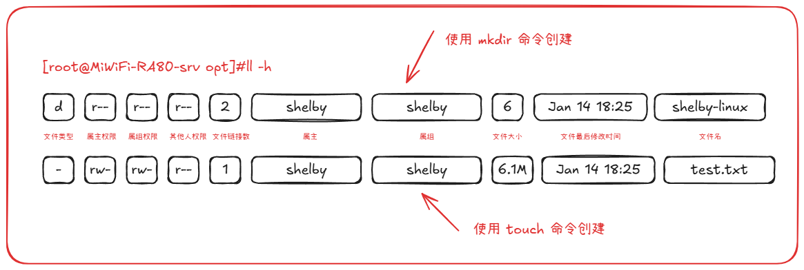

# Linux 文件权限管理

## 权限分类

|                   | 权限针对文件，file                                   | 权限针对目录，directory                                      |
| ----------------- | ---------------------------------------------------- | ------------------------------------------------------------ |
| 读r，read         | 表示可以查看文件内容：cat                            | 表示可以查看目录中存在的文件名称：ls                         |
| 写w，write        | 表示可以更改文件的内容：vim修改，保存，退出          | 表示是否可以删除目录中的子文件或者新建子目录（rm/touch/mkdir） |
| 执行x，executable | 表示是否可以执行文件，一般指的是二进制文件或脚本文件 | 表示是否可以进入目录中（cd）                                 |

## ll -h 看到的权限解读



- Linux 中每一个文件都有自己的主任，并且有权限限制，限制主人的读、写、执行权限。**（特列：root用户）**
- 限制其他人的读、写、执行权限。
- 限制组内的读、写、执行权限。
- 权限必须是 rwx 的顺序，如果没有对应的权限，则用 - 表示为空。比如只有读写权限，没有执行权限，比如：rw-

## Linux 七种文件类型

> 后面带有 * 号标识的表示为常用类型

| 标识       |                           解释                           |
| ---------- | :------------------------------------------------------: |
| **-**（*） |              普通文件，如 touch 创建的文件               |
| **d（*）** |                 文件夹，如 mkdir 创建的                  |
| l（*）     |             软连接，类似 windows 的快捷方式              |
| b          |   块设备信息（如读取硬盘，光盘等 /dev/sda  /dev/sdb）    |
| p          |                         管道文件                         |
| c          |                       字符设备文件                       |
| s          | socket文件，进程间通信文件，比如 mysql 生成的 mysql.sock |

## 创建软连接

### Path 与软连接的区别

1. Path 添加的是整个目录。
2. 软连接，只对单个文件添加快捷方式。

### 使用软连接实现 Path 一样的效果

去 Path 中默认的路径下，创建一个快捷方式，指向我们的代码雨命令

```bash
ln -s /usr/local/cmatrix/bin/cmatrix /usr/local/bin

ln -s 命令的原路径 快捷方式的路径
```

### 查看 python 的软连接信息

可以通过 `which` 命令查看命令的信息，然后通过`ll`命令查看命令的真实信息

```bash
[root@MiWiFi-RA80-srv opt]# which python
/usr/bin/python
[root@MiWiFi-RA80-srv opt]# ll /usr/bin/python
lrwxrwxrwx. 1 root root 7 Jan 24 16:18 /usr/bin/python -> python2

[root@MiWiFi-RA80-srv opt]#  which python2
/usr/bin/python2
[root@MiWiFi-RA80-srv opt]# ll /usr/bin/python2
lrwxrwxrwx. 1 root root 9 Jan 24 16:18 /usr/bin/python2 -> python2.7

# 这个 python2.7 才是真正的可执行命令
[root@MiWiFi-RA80-srv opt]# ll /usr/bin/python2.7
-rwxr-xr-x. 1 root root 7144 Nov 15  2023 /usr/bin/python2.7
```

## 文件权限与数字转换

### 文件权限（字母、数字表示）

| 权限 | 对应数字 | 意义   |
| ---- | -------- | ------ |
| r    | 4        | 可读   |
| w    | 2        | 可写   |
| z    | 1        | 可执行 |
| -    | 0        | 无权限 |

### 文件权限数字字母转换练习

```
文件：/tmp/mima.txt

- rw- -w- rwx cc01 cc01   --->   user:4+2+0 group:0+2+0 other:4+2+1   --->   627
- r-- rwx --x  cc01 devops   --->   user:4+0+0 group:4+2+1 other:0+0+1   --->   471
- --x rw- rw- bob01 bob01   --->   user:0+0+1 group:4+2+0 other:4+2+0   --->   166
- -w- -w- -w-jack01 aliyun01   --->   user:0+2+0 group:0+2+0 other:0+2+0   --->   222 
```

## chmod 命令

- 语法：chmod 选项 权限 文件
- 作用：设置、修改文件的权限（包括设置user，group，other对应的权限）
- 选项：`-R` 递归设置文件夹权限
- 注意：使用该命令，要么是 root 登录，要么是属主（你不可能随便修改别人的文件权限）

### 文件操作演示

> 以chenyufan01登录，演示普通用户，对文件的 r w x分别表示什么

```bash
touch 随风奔跑.txt

# 给 user 权限降到最低
chmod u-r 随风奔跑.txt
chmod u-w 随风奔跑.txt
chmod u-r 随风奔跑.txt
# 给 user 的权限全部加上
chmod u+r,u+w,u+x

# 演示 group 的 r w x
# 字母权限的增加、减少，如下：
chmod g-r,g-w 随风奔跑.txt
# 其他权限的数字权限只写不读，如下：
-rwx---r-- 1 chenyufan01 devops 22 3月 16 11:29 随风奔跑.txt
chmod 702 随风奔跑.txt

# say_hello.sh 脚本，设置为 user只读，group可读可写，其他人可读可写可执行
chmod 467 say_hello.sh
```

### 常用的修改用户权限的命令

- chmod：设置、修改文件的权限
- chgrp：修改文件的属组，group
  - `chgrp wuyifan01 say_hello.sh`
- chown：修改文件的属主，user
  - `chown wuyifan01 say_hello.sh`

## 文件夹的读写执行

> 创建文件夹，分别查看读、写、执行的权限**（要想在文件夹下创建文件，必须要有可执行(x)权限）**

```bash
# wuyifan创建文件夹
mkdir 吴亦凡的歌
# 清空权限
chmod 000 吴亦凡的歌/
                                                    # luozhixiang查看，提示权限不够
                                                    ls 吴亦凡的歌/
# 使用用户wuyifan给该文件夹其他人权限添加可读权限
chmod o+r 吴亦凡的歌/
													# luozhixiang可以查看文件夹了，他创建一个APT.music会提示无权限
													touch 吴亦凡的歌/APT.music
# 使用用户wuyifan给该文件夹其他人权限添加可读可写权限
chmod 006 吴亦凡的歌/
													# 此时luozhixiang创建APT.music依旧提示无权限，要想可以创建，必须要有x权限
# 使用用户wuyifan给该文件夹其他人权限添加可读可写可执行权限
chmod 007 吴亦凡的歌/
													# 此时luozhixiang创建APT.music，可完成创建
```

