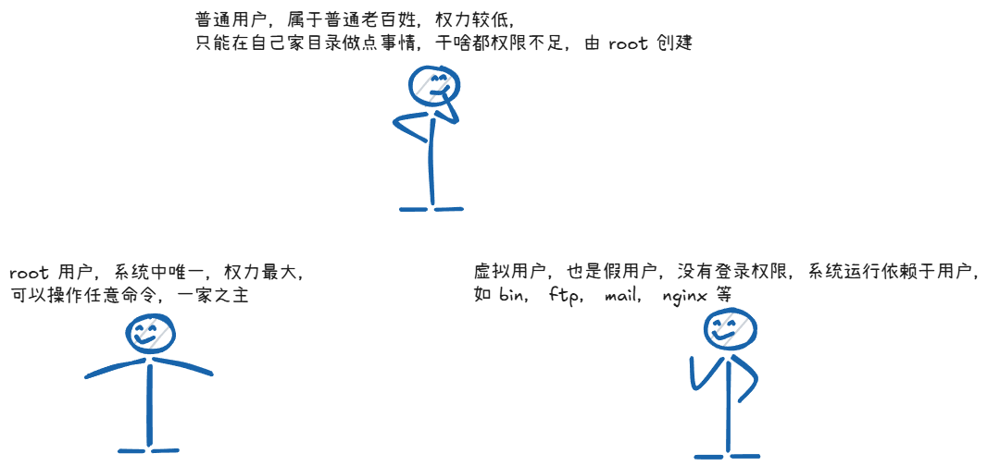
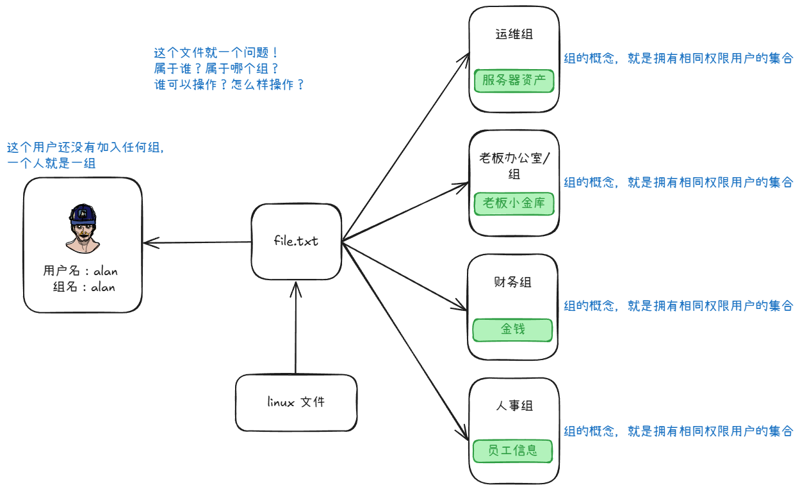
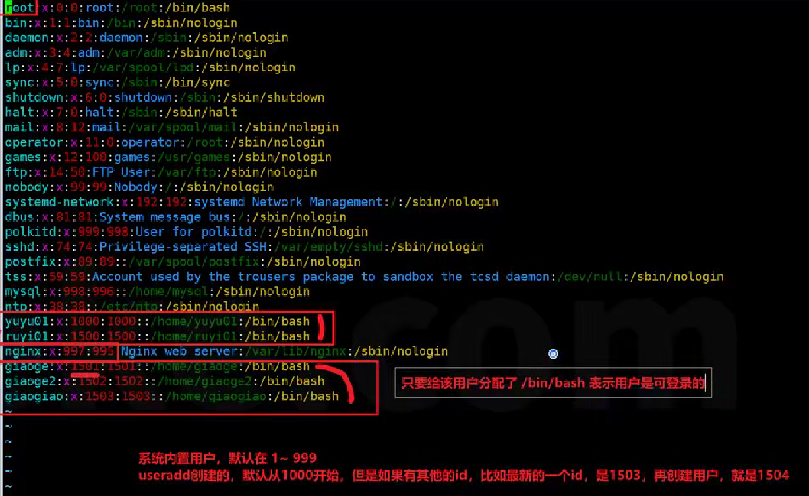

# Linux 用户管理

## Linux 用户分类

1. Linux 系统不同用户权限不同，为了保护隐私和资料安全，开通的普通用户权限较低，在全县范围内普通用户可以随便折腾，可通过 `useradd` 命令创建。

2. Linux 有默认创建的用户，如 ftp, nobody 等等，用户信息存放在 `/etc/passwd` 中

3. 还有部分用户是安装软件自动创建的，如 nginx ，mysql 等用户，他们是不允许登录的，只是用于程序的运行

   

## 关于 root

1. root 为什么是 root 呢？为什么权重最大呢？因为他的 UID 是0，系统根据用户的 id 号，决定它的作用
2. Linux 中的每一个用户，都有一个自己的组

## 图解组的概念



## Linux 的用户组

- 为了方便管理属于同一组的用户，Linux 系统中还引入了用户组的概念。
  - 通过使用用户号码（GID Group IDentification），我们可以把多个用户加入到同一组中，从而方便组中的用户统一规划权限或指定任务。
- 对于 Linux 而言，比如公司的开发部门，需要访问服务器上的一个文件夹的资料，并允许读取，允许写入，开发部门有30个人，你要给每个人都添加读写权限吗？
- 那必然是给开发部门设置权限，整个部门允许读写该文件夹，然后属于该部门的人，自然就有个组内的权限，后续开发部门招新人，只要加入组内，权限也就有了。
- Linux 管理员在创建用户时，将自动创建一个与其同名的用户组，整个用户组只有该用于一个人。
  - `useradd alan01`
- 主组：Linux 用户创建时会自动创建一个同名的组，称之为**主组**，且主组只能由一个。
- 附加组：出了主组之外，用户还可以加入其他组，属于多个组，额外添加的组，就叫做附加组，且可以获得附加组的权限。

## 用户于用户组的关系

1. 一对一，一个用户可以存在一个组里，组里可以就一个成员
2. 一对多，一个用户可以呆在多个组里
3. 多对一，多个用户可以在一个组里，这些用户和组有相同的权限
4. 多对多，多个用户存在多个组里

## 用户配置文件



1. 配置文件路径：`/etc/passwd`
2. 系统内置用户，默认的 id 在1-999之间，useradd 创建的，默认从1000开始，但如果有其他的 id，比如最新的一个 id 是1503，再创建就是 1504。
3. 只要给用户分配了 `/bin/bash` 解释器，表示用户就是可登录的
4. 如果是 ``/sbin/nologin`` 表示该用户是无法 ssh 登录机器的
5. 格式：**用户名  密码  UID  GID  用户注释  用户家目录  用户使用的解释器**
6. 和用户创建相关的配置文件：
   1. /etc/passwd：用户信息
   2. /etc/shadow：用户密码信息
   3. /etc/group：用户组信息
   4. /etc/gshadow：用户组密码信息
   5. /etc/skel：用于初始化用户根目录，系统会把此目录下的所有文件、目录都复制到新建用户的根目录，并且将用户属组与用户组调整为此根目录相同。

## 组管理

### groupadd 组添加

1. 语法：

   ```
   groupadd 参数 组名
   -g 设置组id号，默认从1000开始，1-999是系统预留的组
   ```

2. 实践

   ```bash
   groupadd devops
   ```

3. 注意

   1. 执行后不会有结果，就是正常的现象
   2. 大多数情况下，命令敲完了，没有提示，就是好结果
   3. 又提示，一般情况下可能出错了

### groupmod 组修改

1. 语法：

   ```
   groupmod 参数 组名
   -g 设置组id号
   -n name缩写，可设置组名
   ```

2. 实践：将 devops 组信息修改了

   ```
   groupmod -g 1005 -n opsgroup devops
   ```

### groupmod 组删除

1. 语法：

   ```
   groupdel 组名
   ```

2. 实践：将 devops 组信息修改了

   ```
   groupdel opsgroup
   ```

## 用户管理

### useradd 添加用户

1. 语法

   ```
   useradd [选项 选项值] ... 用户名
   
   选项：
   -g：表示指定用户的用户主（主要）组，选项值可以是用户组 ID，
   
   -G：表示指定用户的用户附加组，选项值可以是用户组 ID，也可以是组名
   
   -u：uid，用户的id（用户的标识符），系统默认从500/1000之后按顺序分配uid，如果不想使用系统分配的，可以通过选项配置具体的值
   
   -c：comment，添加注释，非必须
   
   -s：指定用户登入后使用的 shell 解释器，默认 /bin/bash，如果不想让其登录，可以配置为 /sbin/nologin
   
   -d：指定用户登入时的启示目录（家目录的位置）
   
   -n：取消建立以用户为名的群组（了解）
   
   ```

### 用户创建过程

1. 在 /etc/passwd 文件中创建一行关于 alan 的用户数据
2. 在 /etc/shadow 文件中增加一行关于 alan 的密码数据
3. 在 /etc/group 文件中创建一行与用户名相同的组，例如 alan
4. 在 /etc/gshadow 文件中新增一行与新增群组相关的密码信息，例如 alan
5. 自动创建用户的家目录，默认在 /home 下，与用户童敏，如 /home/alan

### id 命令查看用户信息

1. 命令：id

2. 作用：查看一个用户的一些基本信息（包含用户 id，用户组 id，附加组 id...），该指令如果不指定用户，则默认当前用户。

3. 如何验证 id 命令看到的信息是否正常？最正确的方式就是看配置文件，用户信息都在 /etc/passwd 中

4. id 命令参数：

   ```
   -u：显示用户id
   
   -g：显示组id
   
   -un：显示用户名
   
   -gn：显示组名
   ```

### usermod 修改用户信息

1. 命令：usermod

2. 语法：usermod [选项 选项值] ... 用户名

3. 作用：修改用户各种属性，只能修改未登录的用户信息

4. 选项：

   ```
   -g：表示指定用户的用户组，选项的值可以是用户组的 ID，也可以是组名
   
   -G：表示指定用户的用户附加组，选项的值可以是用户组的 ID，也可以是组名
   
   -u：uid，用户的id，系统默认会从 500 之后顺序分配 uid，不想默认，可以通过选项配置指定值
   
   -L：锁定用户，锁定后，用户无法登录系统 locak
   
   -U：解锁用户 unlock
   
   -c：修改用户账号的备注文字
   
   -d：修改用户登入时的目录
   
   -s：修改用户登入后所使用的 shell
   ```

### userdel 删除用户

1. 注：建议注释 /etc/passwd 用户信息，而非直接删除用户

2. 命令：userdel

3. 语法：userdel (选项) (参数)

4. 作用：删除用户以及用户家目录

5. 参数：

   ```
   -f：强制删除用户，即便当前用户已登录
   
   -r：删除用户的同时，删除与用户相关的所有文件
   
   例如：
   userdel alan  # 保留家目录
   
   userdel -rf alan  # 强制删除用户与其家目录
   ```

### 查看用户登录记录

1. 打印当前用户名：whoami
2. 显示已登录的用户终端信息：
   1. tty：虚拟终端的代称
   2. pts/序号：ssh远程终端的代称，如pts/1，pts/2
3. 显示最近登录的终端记录：last -5，显示最新的五条登录记录
4. 显示关于用户的登录记录：lastlog

## Linux 用户身份切换命令

### su 命令

Linux 中用户登录后，可以切换角色，比如 alan 用户切换到 root

工作里一般不会直接使用 root 登录，而是大家都使用普通账号，保护服务器安全，降低误操作，因为普通用户权限低。

当你需要执行高权限的操作，你需要使用 root 账号，就可以进行角色切换。

1. 语法：su -用户名
2. 示例：
   1. `su root` ：没有短横线的 su，工作路径不变
   2. `su - root`：有短横线的 su，自动进入家目录

### sudo 命令

1. sudo 命令用来以其他身份执行命令，预设的身份为 root，在 /etc/sudoers 中设置可执行 sudo 指令的用户。
2. 作用：让普通用户不需要 root 密码即可用 root 权限执行命令。
3. 用户提权，提升为 root 身份去执行命令。
