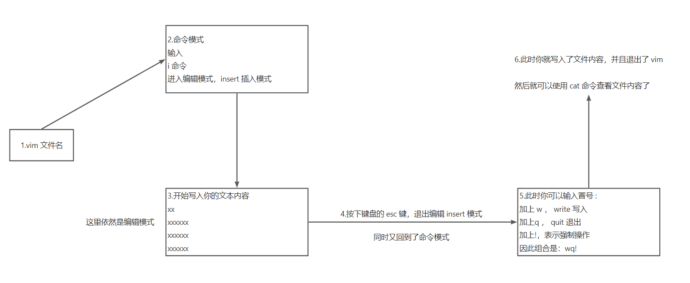
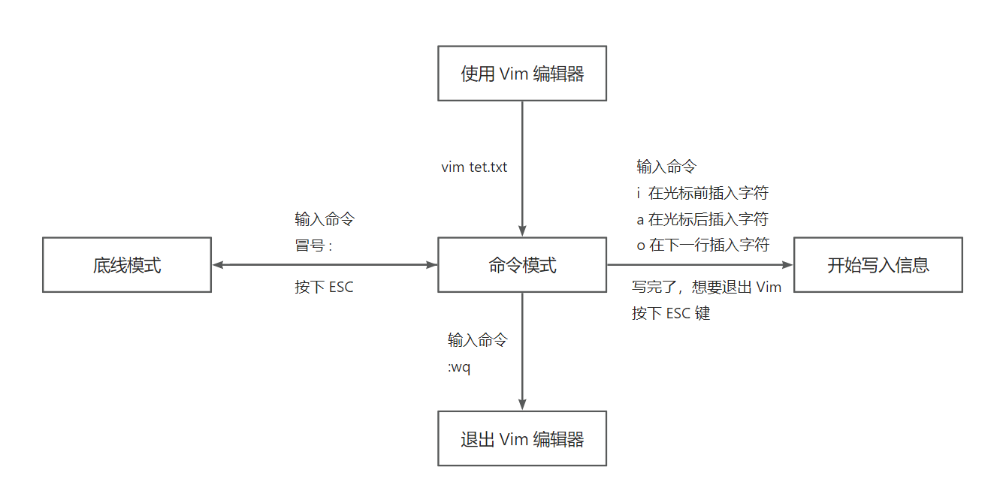
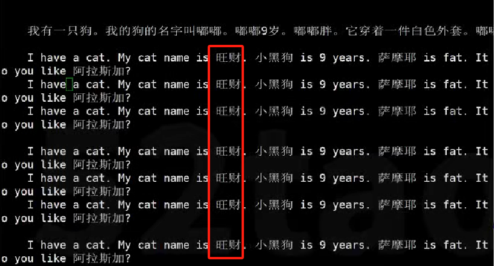
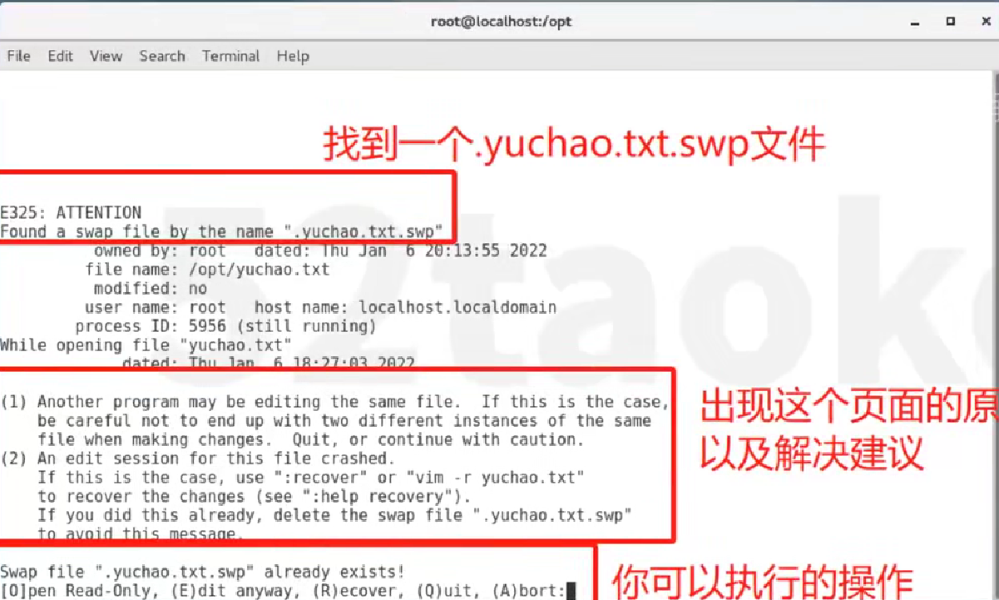

# Vim 文本编辑器

## 图解 Vim 流程

## Vim 三种模式

1. 命令模式（Command mode）
   1. 最常用的，按下字母 a,i,o（a 在光标后开始编辑；i 是在光标处开始编辑；o 是在光标下一行开始编辑。）
2. 输入模式（Insert mode）
   1. 可对文件内容进行编辑。
   2. 退出编辑模式按下 ESC 键，回到命令模式。
3. 末行模式（Last line mode）
   1. 从命令模式下，输入冒号，即进入末行模式。
   2. 进行一些特殊操作，比如文本信息的查找、替换、保存、退出等。

## 命令模式

1. Vim 打开文件，复制粘贴数据是需要注意：
   1. 仅仅复制粘贴的是中文英文语句还好，可以直接粘贴
   2. 如果是代码，有固定格式的文本比如 yaml、xml、py、html 等，就得进入 Vim 的粘贴模式，方可保持正确的格式。
2. Vim 打开文件显示行号：`:set nu` ，取消行号：`:set nonu`
3. 行首、行尾
   1. `gg`：移动光标到问文档的首行
   2. `G`：移动光标到文档的尾行【按下 shift + g】
4. 定位到指定行：工作里经常会遇见代码部署出现错误信息，且程序会自动告诉你大约哪一行，可以根据提示的行数，按下`行号 + G` 即可快速跳转，或者使用`:行号` 也可以。
5. 复制、粘贴、撤销、恢复
   1. `yy`：复制单行
   2. `3yy`：**数字**+yy表示复制光标所在行向下的**数字**行（包含光标所在行）
   3. `p`：在光标处，下行打印；`P`：在光标上一行打印
6. 剪切、删除
   1. 作用：剪切后可以选择是否粘贴，如果不粘贴就相当于删除操作
   2. `dd`：剪切光标所在的当前行
   3. `数字 + dd`：剪切指定的行，包括当前行，比如光标在第2行，输入`5dd`，会将第2-5行的内容剪切
   4. `D`：删除当前行、光标处、以及后续内容
   5. `dG`：删除光标所在的当前行到文档末尾的所有内容
   6. `x`：删除光标所在字符
7. 撤销、恢复
   1. 撤销：按下`u`，即可撤销上一步的动作
   2. 恢复：按下`ctrl + r`可以恢复撤销的内容

## 末行模式

1. 进入末行模式
   1. 用 Vim，在命令模式下，你要退出编辑模式
   2. 按下 ESC 回到命令模式
   3. 在命令模式下，输入英文冒号，进入末行模式
2. 写入数据 write
   1. 用 Vim 编辑器写入文件内容
   2. `:w` 末行模式下的 write 模式，写入文件数据
3. 退出 quit
   1. `:q`末行模式下直接退出
4. 保存并且退出
   1. `:wq` 末行模式下保存并退出
5. 强制，感叹号
   1. `:q!`  末行模式下强制性不写入文件内容退出 Vim

## 搜索、查找、替换

1. 搜索、查找
   1. 查找你想要的内容，可以直接在 Vim 的命令模式下，输入 `/` ，后面跟上你要查找的内容关键字
   2. 例如：命令模式下，输入：`/悟空` ，搜索到的内容会高亮显示，按`n`键可以向下搜索
   3. 取消搜索后的高亮关键词：在 Vim 的命令模式下，输入`:noh` 
2. 替换
   1. 单行替换（推荐），只替换一次：`:s/原内容/新内容/`
   2. 单行替换（推荐），替换N次：`:s/原内容/新内容/g`
   3. 全篇替换（慎重），全文替换，逐行匹配，找到第一个关键字，只替换一次：`:%s/原内容/新内容/`
   4. 全篇替换（慎重），全文替换：`:%s/原内容/新内容/g`

## 粘贴模式

1. 使用场景：日常工作中，我们会频繁的复制粘贴各种配置，并且大多数配置文件都是有缩进格式的，此时就需要使用该模式。
2. 在末行模式下，输入`:set paste` 进入粘贴模式，此时再进入编辑模式，粘贴带有格式的文本，就不会出现格式错乱的问题了。
   1. `:set paste` 进入粘贴模式
   2. `:set nopaste` 取消粘贴模式

## 可视化选择模式

如上图所示，如果需要将红框中所有的”旺财“全部修改，则需要使用 Vim 编辑器的可视化选择模式，进入可视化选择模式后，是**列选择模式**。

1. 可视化选择模式如何使用：
   1. 先确定好你的光标位置，如上图光标放到”旺财“的【旺】字上
   2. 按下`ctrl + v`进入可视化选择模式
   3. 此时可以使用方向键，上下左右选择区域
   4. 选择后进入编辑模式，去修改多行文本，输入大写字母`I`，进入批量编辑模式，修改对应的文本后，按两下`ESC`键完成批量修改

## 故障处理

当用 Vim 编辑器，会遇见这样一个错误页面，这个错误很常见：

> 出现 swp 文件的原因：

1. 多个人同时编辑了一个文件
2. 编辑文件时，没有正常保存退出

> 为什么会出现 swp 文件呢？

1. 由于多人同时编辑一个文件，系统不知道应该保存谁的，为了保护文件数据，才会产生 swp 文件。

> 出现 swp 文件后如何解决呢？

1. 不要未保存的数据：直接删除这个 swp 文件即可
2. 要未保存的数据：
   1. 继续打开文件：`vim test.html`
   2. 发现 swp 错误提示：输入`R`，recover 恢复
   3. 继续编辑，然后正常保存退出`:wq`
   4. 删除 swp 文件即可
